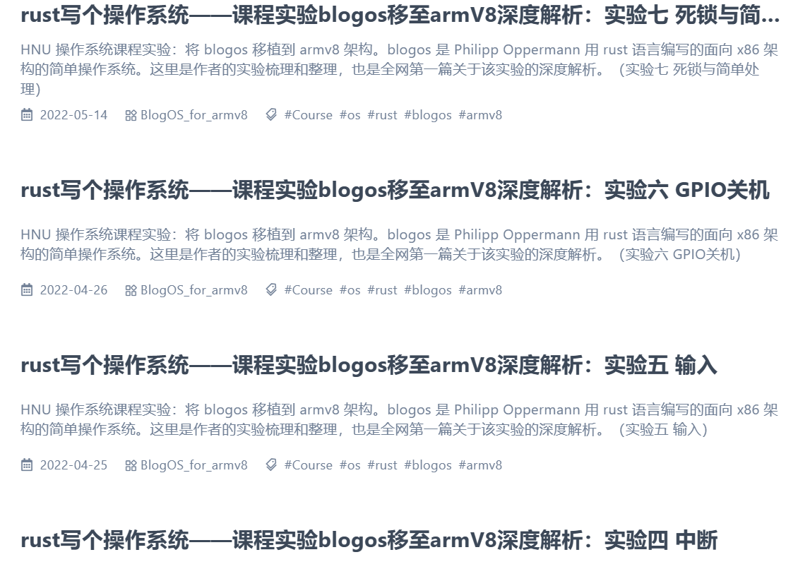

# hexo-theme-trefoil

> More elegant article serialization, and simple single column layout theme for Hexo.
> 
> 一个试图更优雅的系列化文章，和简单的单栏布局设计的 Hexo 主题。

同时这也是一份思路笔记（以下是一些想法记录）

[TOC]


## 主题功能性需求

### 单文章与系列

这个在 `stellar` 主题有类似的 wiki 系统，但是隔离出的项目 wiki 并不适用于系列，本质上系列并不应该变成 project，仍旧该被归类为分享类的博文、文章，例如我的 blogos 系列课程实验教程。

这类长系列有一些共同的特点

* **单篇幅长**，整个系列不适合用单个文件描述
* 本身也不像项目文档那样非线性阅读（项目文档属于读者根据目录各取所需），大多看教程的人是线性的，回顾一些细节才需要到处跳
* 需要有个**总览页**


另外在首页上，观感上不喜欢有一堆相同的标题描述，例如如下栗子：




连续的相似标题会有视觉上的疲惫感。实际上这一整个系列只需要有一个总览性的卡片足以。例如


对系列设计独立的单张封面页和概括性描述，比起一长串的相似卡片好了不知道多少倍。（可惜 stellar只有 wiki ，没有与博文可以一并放在首页的玩意，略略有些遗憾）

既然是系列封面与各个系列页面，自然要有单独的封面模版和页面模版，这点暂时不表（UI 设计时再说）

单页面文章就很传统，不需要过多的说明。

### 外挂标签

外挂标签本身是我常使用的功能之一，自然设计主题也要考虑到这个，目前拟定的一些基础标签有：

- 行内文本
- quot 引用（[#quot-引用](https://xaoxuu.com/wiki/stellar/tag-plugins/express/#quot-引用)）
- 诗词（这个还是喜欢店长设计的版本，虽然我也不常用）
- 彩色note
- link连接卡片
- 复制行
- 单选框
- 复选框
- 时间线（这个超级喜欢 stellar 的时间线 [#timeline-时间线](https://xaoxuu.com/wiki/stellar/tag-plugins/data/#timeline-时间线)）
- 彩色可折叠容器块
- folders 多个折叠容器聚合
- tabs 分栏容器

这里本身不想做太多的标签设计，一切用静态的内容呈现（stellar 有许多是采用 api 动态生成，但这里想精简点）

### 【额外】与友圈贴合的动态友链系统和样式展示

不想要 stellar 那么精简的友链设计，这个作为额外设计

### 【额外】便签

一个用来放一些不是博文但是又有必要记录东西，一般作为参考归类。例如一些标签外挂的语法参考记录等等


## 渲染设计思路

### 系列树与系列目录树

这点主要针对复杂的“系列”文章系统设计，目前的打算是通过 front-matter 进行控制

因为本身作为普通文章页，仍旧希望编写文章时文件再 _post 文件夹下。至于用户如何进行文件夹管理不应该作为设计考虑（尽量容纳无理的用户，不然文档真就自己看的了）

stellar 使用独立 yml 进行控制，暂时不会考虑以这种方式。

```yaml
---
layout: series
series-name: trefoil
series-index: 0
---
```

`series-name` 指明某同一系列

`series-index` 指明首页（0）和文章页（1 - ?），并采用不同的 UI 布局。

原理上可以通过系列名和索引构建相应的目录树（这点按照预期应该放在 hexo 渲染的开始，具体仍旧需要先尝试 hexo 本身的框架设计，不排除构建文件记录来变相进行全局变量记录的偏方）

```yaml
- 魔改日记本: 
  - 0: 
    - 1: 菜单栏及移动端侧边菜单栏的魔改
    - 2: 小菜单和复制/F12提示栏
    - 3: 小小的重写个页脚
    - 4: 文章页抛弃卡片、丢弃小菜单以及布局重构
- BlogOs-armV8:
  - 0:
    - 1: 实验一 环境配置
    - 2: 实验二 Hello World
    - 3: 实验四 中断
    - 4: 实验五 输入
    - 5: 实验六 GPIO关机
    - 6: 实验七 死锁与简单处理
    - 7: 实验八上 内存管理
    - 8: 实验八下 内存管理
```

对系列文章构建类似的目录树总览和对应的整体目录树

```yaml
// BlogOs-armV8

h1: 实验一 环境配置
  h2: 实验目的
  h2: 环境安装
    h3: 安装rust
    h3: 为rust增加armv8支持
    h3: 安装QEMU模拟器
    h3: 安装交叉编译工具链 (aarch64) 及其调试工具
  h2: 构建最小化内核
    h3: 能跑起来的裸机程序尝试
    h3: 程序的开始：”Hello World”
  h2: gdb调试
    h3: qemu 启动参数
    h3: 启动调试
h1: 实验二 Hello World
  h2: 实验目的
  h2: rust 宏（选看）
    h3: 什么是宏？
    h3: 宏和函数的区别
    h3: 宏的分类
    h3: 声明宏
  h2: Write 实例实现和测试
    h3: 实例实现
    h3: 测试
  h2: print!和println!封装
    h3: Write全局接口
    h3: 实现 print! 宏
    h3: 调用宏并测试
h1: 实验四 中断
  h2: 实验目的
  h2: 中断原理
    h3: 中断是什么
    h3: 中断如何发生
    h3: 中断的大概流程
  h2: GIC内核驱动编写及调用
    h3: 中断控制器GICv2
      h4: gic中断分发器(Distributor)
      h4: gic中断接口(cpu interface)
    h3: gicv2内核驱动
      h4: 寄存器定义
      h4: GIC初始化
      h4: GIC相关函数
  h2: ArmV8中断机制及异常回调
    h3: 异常向量表
    h3: 异常处理回调函数
  h2: Timer计时器的原理和时钟中断服务实现
    h3: Timer计时器介绍
    h3: 时钟中断服务
h1: 实验五 输入
  h2: 实验目的
  h2: 时钟中断回调函数实现
  h2: pl011（UART）异步串行接口驱动编写
    h3: tock-registers
    h3: 驱动编写
  h2: 串口输入中断处理回调
    h3: 输入中断初始化
    h3: 输入中断处理回调
h1: 实验六 GPIO关机
  h2: 实验目的
  h2: pl061（GPIO）模块驱动编写
    h3: pl061（GPIO）基本知识
    h3: virt机器关机原理
    h3: 驱动编写实例
    h3: 寄存器基本结构描述
    h3: 寄存器位级细节
  h2: 实现关机中断及其处理回调函数
    h3: 关机中断初始化
    h3: 关机中断处理回调
h1: 实验七 死锁与简单处理
  h2: 实验目的
  h2: 死锁原理
  h2: 引发死锁
  h2: 针对该情况的死锁预防
  h2: 常规死锁解决办法
h1: 实验八上 内存管理
  h2: 实验目的
  h2: 使用identity mapping映射（无偏移的映射）
    h3: Armv8的地址转换
    h3: 内存直接映射
  h2: 使用identity mapping映射（外设映射偏移尝试）
h1: 实验八下 内存管理
  h2: 实验目的
  h2: 非identity mapping映射：块映射
  h2: 非identity mapping映射：分页映射
```

构建目录树应该被构建成工具函数。显然在系列的封面页和文章页都需要这样的目录树。另外要有完善的路由指向，这样目录标题项才能被合适的标记。

* 基于文档编写规范，这里只渲染 2 - 4 级标题到目录中。h1 标题应当作为整个文档的总标题被使用，而过深的标题不利于样式的设计和文章的表达

  ```javascript
  toc(page.content, {list_number: tocNumber, max_depth = 4, min_depth = 2})
  ```

* 这里需要明确的一点是，hexo 自带的目录生成方法 toc `<%- toc(str, [options]) %>`，生成的是直接以 `#` 开头的相对锚点链接。如若直接使用 toc 方法，则系列目录树必须先进行一次 h1 跳转（绝对地址跳转到对应文章开头），再进行一次文章内 toc 的跳转。

    ```javascript
    .doc-toc-tree
      each page in site.posts
        - let tocNumber = page.toc_number !== undefined ? page.toc_number : theme.toc.number
        .doc-toc-tree-block
          a.doc-toc-tree-h1(href=url_for(page).link title=page.subtitle)
          .doc-toc-tree-content != toc(page.content, {list_number: tocNumber, max_depth = 4, min_depth = 2})
    ```

* 一些节约开销的设计：

  既然二次跳转，不妨只留表而不求里：

  ```html
  <div class = "doc-toc-tree">
      <div class = "doc-toc-tree-block">
          <a class = "doc-toc-tree-h1">...</a></div>
      
      <div class = "doc-toc-tree-block active">
          <a class = "doc-toc-tree-h1 active">...</a>
          <div class = "doc-toc-tree-content">
              <toc>...</toc>
          </div>
      </div>
      
      <div class = "doc-toc-tree-block">
          <a class = "doc-toc-tree-h1"></a>...</div>
      <div class = "doc-toc-tree-block">
          <a class = "doc-toc-tree-h1"></a>...</div>
      <div class = "doc-toc-tree-block">
          <a class = "doc-toc-tree-h1"></a>...</div>
  </div>
  ```

  在当前文章之中并不加入其它文章的目录，这样也能使生成系列目录树更加轻松简洁（不过完整的系列目录树还在考虑会不会放在系列封面页）


### 主副标题

考虑到 SEO 的关系，系列的单篇文章可能仍旧需要长标题，以满足 SEO 关键词权重。但是长标题是不利于制作系列目录树的（系列目录树单篇标题应该被作为 h1 进行设计）

考虑到不希望使用一些独立的配置文件，设计主副标题可能是个更好的主意

根据论文主副标题的常用规范而言：

> **主标题：**主标题是文章总体内容的体现。其要求是恰如其分地概括文章内容，精炼、醒目。最常见的方式是展现文章的关键研究点，如主要观点、研究对象、研究内容、研究目的等。
>
> 1. **题目应反映论文内容**
>
>    *例如，题目《无啮合力齿轮泵结构优化设计》，题目中体现研究对象、目的。但是，在阅读全文后，发现论文使用的方法是ProE,所以论文题目若改成《基于ProE的无啮合力齿轮泵结构优化设计》，就更能体现论文的内容。*
>
> 2. **题目要新颖有创见**
>
>    *例如，题目《骨炭除饮用水氟的机理》，论文中提到目前常用的除氟机理有生成难溶氟化物沉淀、离子交换或配位体交换、物理和化学吸附和络合沉淀等。该论文的研究“新颖”点是骨炭兼有离子交换作用和吸附作用，所以，把题目改成《骨炭的吸附-离子交换作用除应用水氟的机理》，就可以凸现论文的独创性。*
>
> **副标题：**论文题目副标题主要作用有两个，拟定的正标题范围太大，用副标题加以限制；主标题言而未尽，副标题起补充作用，二者相得益彰。
>
> 1. **题名语意未尽，用副题名补充说明报告论文中的特定内容**
> 2. **主标题是虚题，副标题为实题**

而系列文章的分章节名其实很适合作为副标题以及对应 h1，取出各节的副标题来进行系列目录树的构建更为恰当与合理。

```yaml
---
title: rust写个操作系统——课程实验blogos移至armV8深度解析
subtitle: 实验一 环境配置
---
```

在 html 页面的头部 `<head>` 部分对 title、subtitle 进行相应的组装：

```html
<title>rust写个操作系统——课程实验blogos移至armV8深度解析 - 实验一 环境配置 | 贰猹の小窝</title>
```

而在文档目录树中则只取副标题 *实验一 环境配置* 作为 h1 记录

*注：主副标题可能影响 atom/rss 生成，可能需要单独写模板 or 自己写个生成方法*


